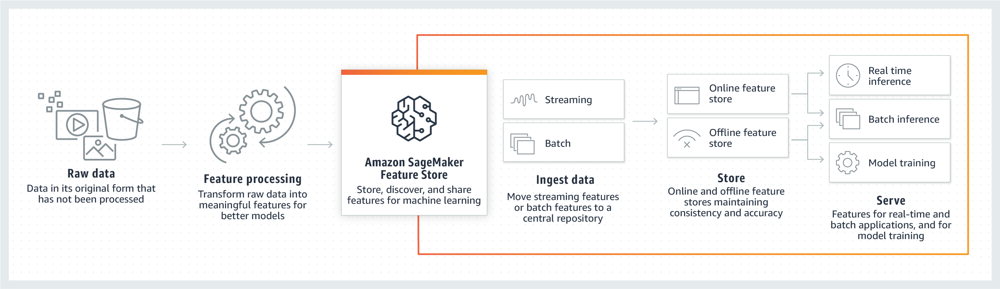
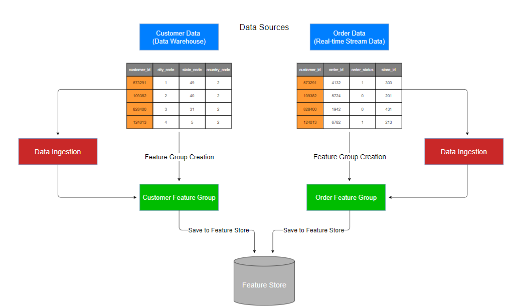
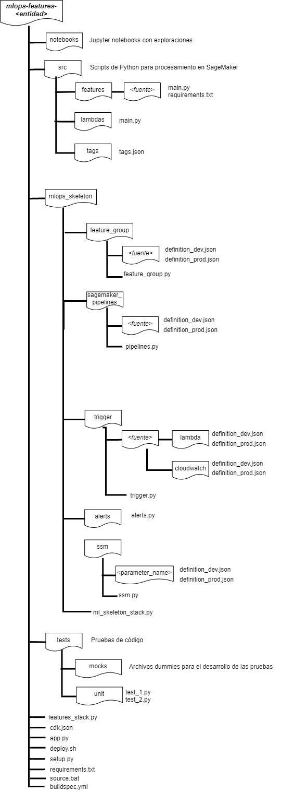

# **Repositorio de features**

Los repositorios de features almacenan los artefactos necesarios para la creación de feature groups y carga de información al feature group dentro del feature store.

A continuación se definen algunos conceptos necesarios para el entendimiento del repositorio:

* **Feature**

Features son los atributos o propiedades que los modelos utilizan durante el entrenamiento y la inferencia para hacer predicciones. Por ejemplo, en una aplicación de ML que recomienda una lista de reproducción de música, los features podrían incluir calificaciones de canciones, qué canciones se escucharon anteriormente y cuánto tiempo se escucharon las canciones.
En el modelo de mundos, los features existentes son producto, categoría, línea, sublínea, entre otros.

* **Feature Group**.

Grupo de features. Se puede visualizar como una tabla en la que cada columna es un feature, y cada registro (fila) cuenta con un identificador único (RecordIdentifier). Un Feature Group se compone de features y valores específicos de cada una de estas. Todos los datos del Feature Group son almacenados en el FeatureStore.
En sí, el Feature Group no contiene datos, contiene los metadatos de todos los datos almacenados en SageMaker Feature Store.

Un Feature Group contiene una lista de Feature Definitions. Una Feature Definition consta de un nombre para cada Feature y su tipo de datos asociado: __Integral__,  __String__ o __Fractional__.
Feature Definition, también contiene el tipo de almacenamiento que se va a llevar a cabo en el FeatureStore:

* Online: Los Features son leídos con baja latencia (milisegundos) y se utilizan para predicciones de alto rendimiento.

* Offline: Usado para entrenamiento e inferencia por lotes (batch). Utiliza AWS S3 (__machine-learning-{nombre-datalab}-featurestore-lab__) para almacenar y los datos pueden ser obtenidos por medio de Athena.

Un Feature Group se puede definir con ambos tipos de almacenamiento.

___Los Feature Definitions de los Feature Groups son inmutables después de su creación. En caso de querer cambiar las definiciones, se debe borrar el Feature Group y crearlo nuevamente___

* **Feature Store**

Amazon SageMaker Feature Store es un repositorio unificado para almacenar, actualizar, recuperar y compartir Feature Groups.



Se presenta un ejemplo de ingesta de datos para un caso de uso donde es necesario contar con información del cliente y sus transacciones:



## **Distribución de carpetas**


El diagrama general de organización de carpetas:



A continuación se presenta una explicación breve de cada carpeta.

---
> ## **notebooks**

En esta carpeta se encuentran todos los notebooks utilizados para validar que las funcionalidades realizadas en los scripts de features sean correctas.

Adicionalmente, se encuentra el notebook ___0._CreacionParametrosSSM___, el cual es usado para crear parámetros en el Parameter Store.
Y un script de utils donde hay funciones claves para el manejo de FeatureGroup, tales como eliminar, construir definiciones, crear un FeatureGroup. Estas funciones pueden ser tomadas para el desarrollo de sus propios scripts. 


Al momento de crear notebooks, tener en cuenta:

- Los nombres de los notebooks deben iniciar con la primera inicial del nombre y primera inicial del apellido del consultor que creó el notebook.

- Los nombres de los notebooks no deberán tener acentos ni espacios para facilitar su manejo.

- Actualmente los notebooks no tienen manejo de versiones, por lo cual se recomienda que cada consultor cree su propio notebook, así se encuentre trabajando colaborativamente con otro compañero.

- Trabajar en paralelo en la construcción de los notebooks de preparación de datos y en los scripts de procesamiento para  industrialización.

- Toda columna del dataset deberá estar nombrada en minúsculas, separada por _ y sin acentos

---
> ## **src**

* features:

Se almacenan los scripts para la construcción de features. Se crea un script por cada Feature Group, en donde se establece el Feature Definition y la forma de ingestar los datos.

El Feature Definition es conformado por:

1. El nombre del FeatureGroup regido al estándar:

        fg-{entidad}-{fuente}-{periodicidad}-{complejidad}

donde,

*__entidad__* = Representa un objeto real o abstracto acerca del cual se almacena información por ser relevante para el sistema. Por ejemplo, producto, cliente, vendedor, cliente-material.
Los *Feature Groups* son reutilizables por lo cual se debe crear bajo ese pensamiento.

*__fuente__* = Fuente de información de donde provendrá la información para poblar *Feature Group*

*__periodicidad__* = Periodicidad de carga de la información al *Feature Group*. Notación en inglés (ej. daily, weekly, monthly, yearly)

*__complejidad__* = Complejidad de las transformaciones realizadas a cada uno de los features que conforman el *FeatureGroup*. Posibles valores: simple, complex.
La complejidad simple es tomada cuando los datos son cargados tal cual como se encuentran en la fuente o si se aplican derivación de features básicos como medias, medianas, desviación estándar.

2. Identificador único del *__Feature Group__*

3. Event time

 Feature asociado al tiempo para efectos de consulta. Puede ser fecha de creación o actualización y si no existe algún feature de tiempo dentro de los datos fuentes, se deberá crear uno (puede ser a partir de la fecha de carga).

4. Definición de cada uno de los campos del *Feature Group*, con los posibles valores __Integral__,  __String__ o __Fractional__.


Además, dentro de cada script se tienen los métodos:

1. load_dataset()

    Carga y procesa los datos dejándolos listos para ser ingestados al Feature Store.
    El dataset retornado debe cumplir con la definición build_feature_definitions

2. create_feature_store()

    Método utilitario para crear el feature group

3. check_feature_group_status()

    Método para verificar el estado del feature group

4. get_feature_type()

    Se obtiene el esquema del feature group

5. build_feature_definitions()

    Se contruye la definición del feature a partir del esquema del mismo

6. main()

  Orquestador de pasos para la creación del feature group en caso de que no exista. Se crea el feature de tiempo en caso tal que no exista en el dataset original.

En este repositorio se pueden ver el ejemplo de dos diferentes archivos de main. main_create_FG.py contiene el paso de crear un FeatureGroup mientras que main_No_create_FG.py no lo contiene puesto que se crea como infraestructura como código en CDK, normalmente el primer script es usado al inicio de la industrialización y el segundo cuando ya se esta desarrollando la infraestructura cómo código. Al final deberá quedar solo uno de los dos scripts.

* *lambdas*

Directorio con la función lambda de inicialización de los pipelines de features.

* *tags*

Contiene el archivo `tags.json` con los tags diligenciados para el proyecto, este archivo sirve de insumo para etiquetar los recursos en el datalab y al momento del despliegue en los demás ambientes.

**Importante**, `a-ambiente` y `a-cuenta` son parámetros del tag variable


---
> ## **test**

En este directorio se almacenan los scripts que serán utilizados con propósitos probar cada unidad del código. Se usa la libería pytest para llevar a cabo las pruebas.

El nivel mínimo de cobertura establecido es de 65% de las líneas de código del proyecto. Es importante aclarar que si más del 50% de un script es no determinístico, ese script deberá ser excluido de los cálculos de la cobertura, esta exclusión deberá ser notificada al equipo de DevOps del proyecto.

**Deterministico** 
Un algoritmo deterministico que utiliza f(n) pasos siempre acaba en n pasos y se obtiene la misma solución.

**No Deterministico**
Un modelo no deterministico (o estocástico), es aquel en el cual información pasada, no permite la formulación de una regla para determinar el resultado preciso de un experimento

__Exclusiones__

Ciertos tipos de archivos no aplican para ser probados, y por lo tanto no serán incluidos en el cálculo de la cobertura:

- Directorio tests que contiene scripts con las pruebas
- Archivos __init__.py (estos permiten importar otros directorios como paquetes de python)
- Scripts de código no determinísticos (ej. entrenamiento de modelos, evaluación)
- Directorio notebooks

Las pruebas unitarias se dividen en dos:

- Pruebas de código

Acá se prueba el funcionamiento de cada uno de los scripts deterministico que se tengan dentro del proyecto.

- Pruebas de infraestructura como código

En las pruebas de infraestructura como código se garantiza que cada uno de los componentes desplegados cumplan con las propiedades esperadas, en el documento 'Documentación de recursos a crear con infraestructura como código' se define por cada uno de los componentes las pruebas que se deben garantizar https://docs.google.com/document/d/1PZ1FAnXvw6Q0wxibh3mHKwOm5v_ZtLmgCo9P8CNMZVI/edit#

Ejemplo de pruebas unitarias 
https://docs.google.com/document/d/14TlGrE1cr2awjPjVBHyPSWCitJOANjmTK6msMdSPcYc/edit#

La carpeta test esta divida en:

- mocks

En esta carpeta se encuentran todos los archivo dummies necesarios para llevar a cabo las pruebas.

- unit

Serie de scripts de pruebas unitarias, los nombre de los scripts deberán iniciar con los caracteres test_, adicionalmente se deben tener un script de prueba por cada script de lógica contenido en la carpeta src.

**Commando para validar la cobertura del proyecto**

    coverage run -m pytest -v -p no:cacheprovider --junitxml=junit/test-results.xml --cov=. --cov-report=xml --cov-report=html --ignore=*/tests/*,*/src/lambdas/*,*/src/evaluate/*,*/src/train/

---
> ## **mlops_skeleton**

En esta carpeta se encuentra la construcción de la arquitectura como código usada para desplegar cada uno de los componentes en las diferentes cuentas del datalake.

El framework utilizado para definir los recursos usados en la nube de AWS es CDK (AWS Cloud Development Kit). Para esto, es necesario instalar los siguientes componentes:

- AWS CLI (https://cdkworkshop.com/15-prerequisites/100-awscli.html)
- Node.js (https://cdkworkshop.com/15-prerequisites/300-nodejs.html)
- Editor de código a gusto para Python (Recomendaciones: https://cdkworkshop.com/15-prerequisites/400-ide.html)
- AWS CDK Toolkit (https://cdkworkshop.com/15-prerequisites/500-toolkit.html)
- Python 3.6 o superior (https://cdkworkshop.com/15-prerequisites/600-python.html)

Para más información sobre CDK, se recomienda revisar el workshop: https://cdkworkshop.com/.

Se tiene carpetas por cada uno de los componentes a desplegar en donde se tiene el archivo __definition.json__ con todo la definición del componente y un script donde se realiza la creación a partir del CDK.

Para la construcción de la infraestructura como código usando CDK se recomienda basarse en la documentación oficial del framework https://docs.aws.amazon.com/cdk/api/latest/python/

La carpeta artifactory contiene 3 diferentes clases que permiten reutilizar las funcionalidades
necesarias en el desarrollo de la solución de CDK:

1. resource_config.py

En esta clase se definen parámetros globales a utilizar en la solución de CDK, estos parámetros pueden ser consumidos desde SSM

2. commons.py

Funciones de uso común en la solución, tal como definición de logging, carga de archivos a S3, borrado de pipelines, etc.  Cualquier función que se pueda reutilizar deberá estar contenida en esta clase.

3. constants.py

Se almacenan constantes a utilizar en la solución de CDK, tales como rutas, nombres de tablas o cualquier otro tipo de constante.

4. base_config.py

Define la forma de acceder a los parameter store y las configuraciones básicas del logging.

**Consideraciones**

El archivo `cdk.json` le indica al CDK Toolkit como ejecutar la aplicación. En el archivo app.py se encuentra la invocación a los stacks del proyecto.

Es prerequisito tener creado un entorno virtual para el uso del framework. Estos entornos virtuales no deben ser cargados al repositorio, por lo cual en el archivo __.gitignore__ hay una serie de nombres de entornos virtuales que son ignorados al momento de un commit. Si no se usa uno de esos nombres incluir el usado en el archivo.

Es una buena práctica que dentro de la infraestructura se automatice el proceso lo más que se pueda, por lo cual, dentro de estas actividades se automatiza la asignación de permisos en LakeFormation, una vez las tablas del proyecto dentro de CDK sean creada.

Para crear manualmente el entorno virtual
```
$ python -m venv .venv
```

Después de crear el entorno virtual, se debe activar
En linux
```
$ source {nombre del entorno virtual}/bin/activate
```
En Windows
```
{nombre del entorno virtual}\Scripts\activate.bat
```

Una vez activo, se debe instalar las dependencias.
```
$ pip install -r requirements.txt
```
Todas la librerías usadas en este parte del proyecto se encuentran listadas en el archivo setup.py

## Comandos útiles

 * `cdk ls`          Lista los stacks de la aplicación
 * `cdk synth`       Ejecuta la aplicación, lo que hace que los recursos definidos en ella se traduzcan en una plantilla de AWS CloudFormation. Este es el primer paso a realizar antes del primer despliegue.
 * `cdk deploy`      Despliega el stack a la cuenta por defecto de AWS/region
 * `cdk diff`        Compara el estado del stack desplegado con los actuales cambios
 * `cdk docs`        Abre la documentación de CDK

En este link se puede encontrar un workshop de CDK para tenerlo como referencia. https://cdkworkshop.com/
